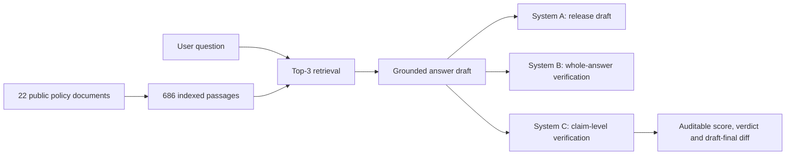

# Trustworthy RAG: Faithfulness, Verification and Evaluation

A public showcase of my MSc Artificial Intelligence and Machine Learning dissertation at the University of Birmingham.

This project investigates a practical question: **does adding verification to a retrieval-augmented generation (RAG) system make its answers more trustworthy, and can automated evaluators be trusted to measure that improvement?**

> The complete implementation, dissertation, annotations and experimental artefacts are maintained privately. This repository presents the research design, technical contribution and verified results without publishing the source code.

## Project overview

The study compares three systems that share the same document corpus, retrieval pipeline, generator and prompt:

| System | Design |
|---|---|
| **A — Baseline RAG** | Retrieves the top three passages and generates a grounded answer. |
| **B — Whole-answer verifier** | Adds a second model call that approves, revises or abstains. |
| **C — Claim-level verifier** | Decomposes drafts into atomic claims, checks each claim against retrieved evidence, applies deterministic citation and quotation checks, and derives an auditable verdict. |

## Research questions

1. What faithfulness failure types occur, and how are they distributed across the systems?
2. Does verification improve abstention when the expected source document is withheld?
3. How well do automated faithfulness metrics agree with human judgement?

## Evaluation design

- **501** generated answerable questions
- **120** document-withholding questions
- **120** blindly annotated answer-text items
- Horvitz–Thompson weighting for the verdict-stratified human sample
- Custom LLM judge and RAGAS Faithfulness evaluated against identical human-labelled items
- Frozen experimental artefacts with SHA-256 integrity checks

## Key findings

- System C surfaced **362 unsupported claims out of 2,370 scored claims (15.3%)**.
- System B increased exact refusal under document withholding from **39.2% to 48.3%** relative to the baseline, with a paired exact McNemar result of **p = 0.000977**.
- System B labelled **178** answers as approved but changed the released text in **103 cases (57.9%)**, demonstrating that a model's verdict can disagree with its own behaviour.
- System C eliminated approve-while-editing inconsistencies through deterministic draft–final comparison, but required approximately **4.8×** the baseline latency.
- Automated evaluation agreed weakly with the human annotator after sampling weights were applied: **51.7%** for the custom judge and **48.8%** for RAGAS.
- Verification changed system behaviour, but stronger intervention did not automatically produce more fully faithful answers.

## Technical contribution

System C makes verification more auditable by moving mechanically decidable checks out of the language model:

- claim decomposition and evidence checking;
- deterministic quotation-presence validation;
- citation-range validation;
- score-derived decisions rather than self-declared verdicts;
- explicit comparison between the draft and released answer;
- recorded reasons for filtered and unsupported claims.

This design separates model interpretation from checks that can be tested and reproduced directly.

## Technology

`Python` · `Ollama` · `Llama 3.2` · `Qwen2.5` · `ChromaDB` · `Sentence Transformers` · `LangChain` · `RAGAS` · `statistical evaluation`

## Skills demonstrated

- Retrieval-augmented generation and semantic search
- LLM verification and abstention design
- Human annotation and weighted evaluation
- Experimental controls and reproducibility
- Statistical analysis and critical interpretation
- Responsible evaluation of LLM-as-judge methods
- Technical research writing and communication

## Access to the implementation

The full repository remains private to protect assessed work, personal information, raw annotations and the complete implementation. I can provide a technical walkthrough or selected implementation details for recruitment and research discussions.

---

© 2026 Meghana Beechiganipalli. Project summary only; all rights reserved.
