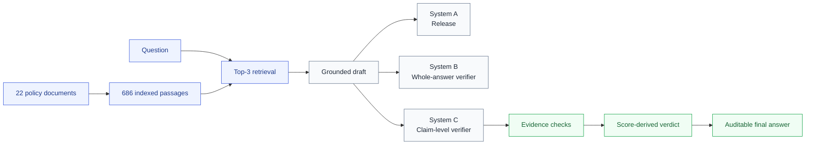

# Trustworthy RAG

### Faithfulness · Claim-level verification · Abstention · Human evaluation

**An MSc Artificial Intelligence and Machine Learning research showcase from the University of Birmingham.**

  
  
  

  
  
  

[Systems](#systems-compared) · [Evaluation](#evaluation-design) · [Findings](#key-findings) · [Contribution](#technical-contribution)

---

## Research question

> **Does adding verification to a retrieval-augmented generation system make its answers more trustworthy—and can automated evaluators be trusted to measure that improvement?**

This project examines faithfulness failures, abstention under missing evidence and agreement between automated metrics and human judgement.

> [!NOTE]
> This public repository is a research showcase. The complete implementation, dissertation, raw annotations and assessed artefacts remain private.

## At a glance

| Study component | Scale |
|---|---:|
| Public policy documents | **22** |
| Indexed passages | **686** |
| Generated answerable questions | **501** |
| Document-withholding questions | **120** |
| Blindly annotated answer-text items | **120** |
| Claims scored in System C | **2,370** |

## Systems compared

| System | Design | Purpose |
|---|---|---|
| **A — Baseline RAG** | Top-three retrieval followed by grounded generation | Establish the unverified baseline |
| **B — Whole-answer verifier** | A second model call approves, revises or abstains | Test model-led answer verification |
| **C — Claim-level verifier** | Atomic claim checks plus deterministic citation and quotation validation | Produce auditable, score-derived decisions |

## Evaluation design

- Shared document corpus, retriever, generator and prompt across all three systems
- Document-withholding intervention to test appropriate abstention
- Blind human annotation of answer-text items
- Horvitz–Thompson weighting for a verdict-stratified sample
- Custom LLM judge and RAGAS Faithfulness evaluated on identical human-labelled items
- Frozen experimental artefacts protected with SHA-256 integrity checks
- Paired exact McNemar testing for abstention differences

## Key findings

| Finding | Result | Interpretation |
|---|---:|---|
| Unsupported claims surfaced by System C | **362 / 2,370 (15.3%)** | Claim-level inspection exposed failures hidden by answer-level labels |
| Exact refusal under withholding: A → B | **39.2% → 48.3%** | Whole-answer verification improved abstention |
| Paired exact McNemar result | **p = 0.000977** | The withholding change was statistically detectable |
| System B approved but edited | **103 / 178 (57.9%)** | A model’s stated verdict often disagreed with its behaviour |
| System C approve-while-editing cases | **0** | Deterministic draft–final checks removed this inconsistency |
| System C latency | **≈ 4.8× baseline** | Auditability introduced a substantial performance cost |
| Weighted agreement: custom judge | **51.7%** | Automated evaluation aligned weakly with the human annotator |
| Weighted agreement: RAGAS | **48.8%** | Metric scores should not be treated as unquestioned ground truth |

### Central conclusion

**Verification changed system behaviour, but stronger intervention did not automatically produce more fully faithful answers.** Auditable checks improved consistency, while evaluation quality and latency remained significant constraints.

## Technical contribution

System C moves mechanically decidable checks out of the language model and into directly testable logic:

- claim decomposition and evidence checking;
- deterministic quotation-presence validation;
- citation-range validation;
- score-derived decisions rather than self-declared verdicts;
- explicit comparison between draft and released answer; and
- recorded reasons for filtered and unsupported claims.

This separates model interpretation from checks that can be reproduced and audited.

## Research questions

1. What faithfulness failure types occur, and how are they distributed across the systems?
2. Does verification improve abstention when the expected source document is withheld?
3. How well do automated faithfulness metrics agree with human judgement?

## Technology

`Python` · `Ollama` · `Llama 3.2` · `Qwen2.5` · `ChromaDB` · `Sentence Transformers` · `LangChain` · `RAGAS` · `statistical evaluation`

## Skills demonstrated

| AI engineering | Research and evaluation |
|---|---|
| Retrieval-augmented generation | Experimental controls and reproducibility |
| Semantic search and vector retrieval | Human annotation design |
| Claim-level verification | Weighted evaluation |
| Abstention mechanisms | Statistical testing |
| Deterministic guardrails | Critical interpretation of LLM-as-judge methods |

## Responsible access

The full repository remains private to protect assessed work, personal information, raw annotations and the complete implementation. A technical walkthrough or selected implementation details can be provided for recruitment and research discussions.

---

  <strong>© 2026 Meghana Beechiganipalli · Research summary only · All rights reserved.</strong>

